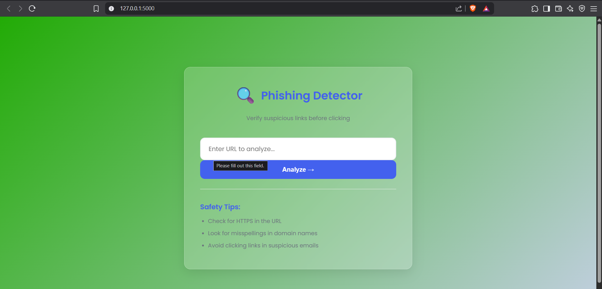
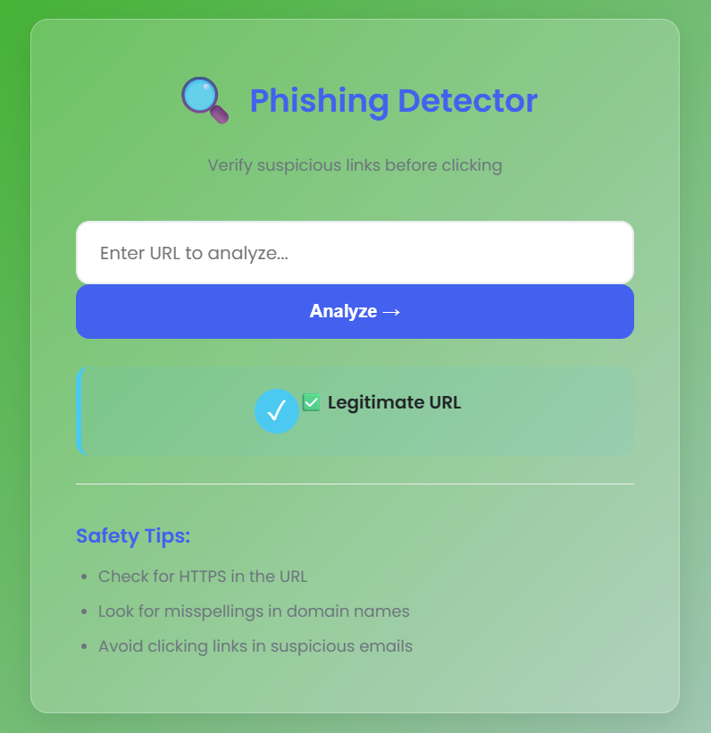
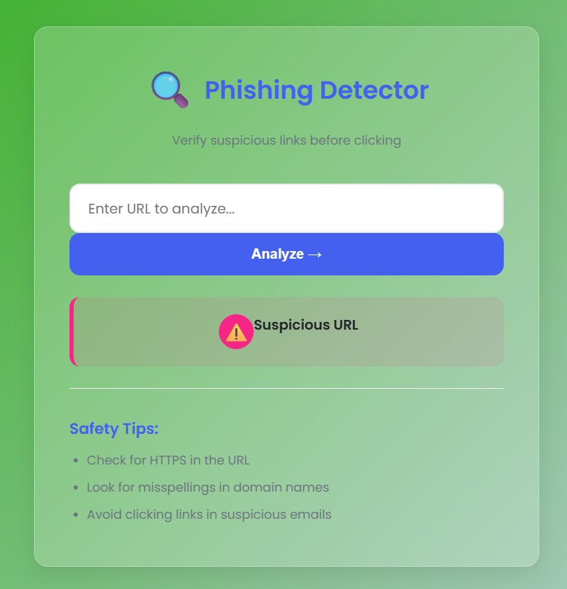
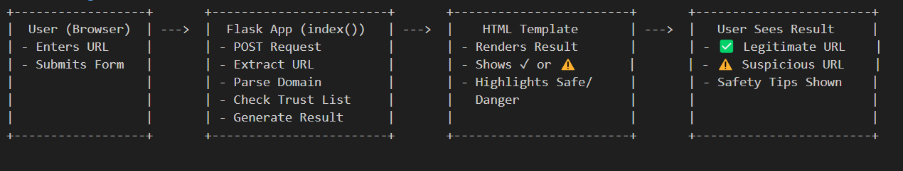

# 🎯 Project Title: Phishing Detector

---

## 👥 Team Members
- **Shahbaz Ali** (Team Leader)
- **Harshit** (Team Member)
- **Himanshu** (Team Member)
- **Kartik Yadav** (Team Member)

---

## 📝 Project Overview
Phishing Detector is a web-based tool that helps users analyze URLs and determine whether they are safe or potentially malicious. It offers a simple and user-friendly interface to input suspicious links and receive a visual safety result.

---

## 🚀 Features
- 🔍 URL Analysis
- ✅ Safe / ⚠️ Suspicious Result Display
- 📋 Safety Tips Display
- 🎨 Clean & Responsive UI

---

## 🧰 Tech Stack
- **Frontend:** HTML5, CSS3
- **Backend:** Python (Flask)
- **Deployment:** Localhost (can be deployed on Render/Heroku)

---

## 🖼 Screenshots/

## Flow Diagram

